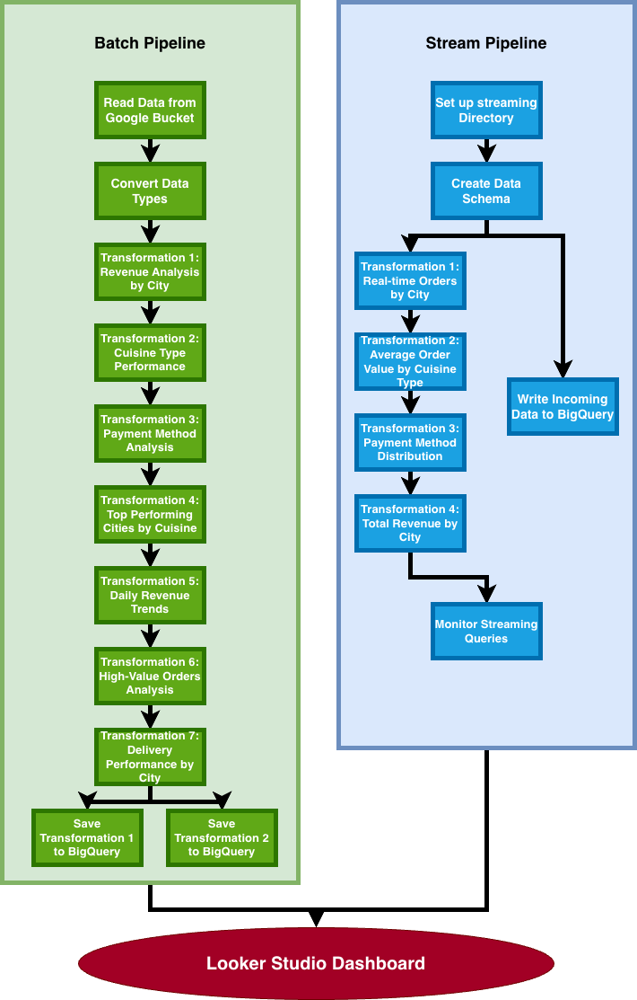

# DE2025 Assignment 2 Group 18

The batch pipeline is stored in lab7, whilst the streaming pipeline is stored in lab9.
They work using the google cloud data buckets as well as BigQuery, eventually displaying everything using looker studio

## Architecture

